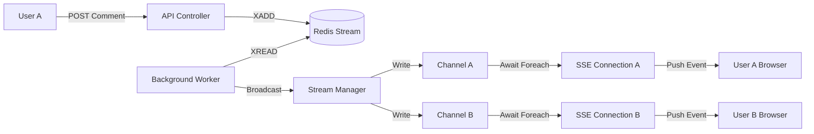

# LiveStreamChatter

LiveStreamChatter is a high-performance, real-time chat application designed for live streaming environments.It is capable to handles high-volume chat traffic, and broadcasts messages in real-time to all connected clients using a modern, scalable architecture.

## 🎥 Demo
[Link to Demo Video]("")

## 🚀 Concept & Flow

The application is built to simulate a high-concurrency chat environment like Twitch or YouTube Live.

### Data Flow
1.  **User Joins**: User enters a username.
    *   **Frontend** calls `POST /api/chat/join` to authenticate and receive a Token.
2.  **User Comments**: User types a message.
    *   **Frontend** sends `POST /api/chat/comment`.
    *   **API** validates the request and pushes the message to **Redis Streams**. This ensures fast write response times and decouples the writer from the readers.
3.  **Real-Time Broadcast**:
    *   A **Background Service** (`CommentService`) works as a consumer, listening to the Redis Stream.
    *   When a new message arrives, the service picks it up and broadcasts it via **Server-Sent Events (SSE)**.
4.  **Client Update**:
    *   All connected clients (listening on `GET /api/sse/stream`) receive the message event instantly and update the UI.

## 🏗 Architecture

The backend follows the **Clean Architecture** (Onion Architecture) principles to ensure separation of concerns, testability, and maintainability.

### Backend (`/Backend`)
*   **LiveStreamChatter.Api**: The entry point. Contains Controllers (REST & SSE) and dependency injection setup.
*   **LiveStreamChatter.Application**: Contains business logic, interfaces, and DTOs. It depends only on the Domain.
*   **LiveStreamChatter.Domain**: The core. Contains entities and enterprise logic. Independent of everything else.
*   **LiveStreamChatter.Infrastructure**: Implementations of interfaces. Handles external concerns like Redis connectivity and Background Services.

### Frontend (`/Frontend`)
*   Built with **React** and **Vite** for blazing fast performance.
*   Uses **Tailwind CSS** for modern, responsive styling.
*   Connects to the backend via standard REST fetch APIs and an `EventSource` connection for real-time updates.

## 🛠 Tech Stack

### Backend
*   **.NET 10** (Latest) - High-performance server runtime.
*   **ASP.NET Core Web API** - For REST endpoints.
*   **Redis (StackExchange.Redis)** - High-speed in-memory data store used for message streaming (`Stream` data type).
*   **Server-Sent Events (SSE)** - For lightweight, unidirectional real-time communication.
*   **Clean Architecture** - Modular code organization.

### Frontend
*   **React 18** - UI Library.
*   **TypeScript** - Type safety.
*   **Vite** - Next-generation frontend tooling.
*   **Tailwind CSS** - Utility-first CSS framework.
*   **Lucide React** - Iconography.

## 🧠 Deep Dive: Technical Flow & Architecture

This application is engineered to handle "Thundering Herd" scenarios typical in live streaming.

### 1. Redis Streams for Decoupling
Instead of the API writing directly to connected clients (which would block the thread and limit throughput), we use **Redis Streams**.
*   **The Writer**: When a user POSTs a comment, we simply append it to a Redis Stream key (`live_comments`) and return 200 OK immediately. This is extremely fast (sub-millisecond).
*   **The Reader**: A background service (`CommentService.cs`) constantly polls this stream for new messages.

### 2. System.Threading.Channels for Buffering
We use .NET's `System.Threading.Channels` to bridge the gap between the Background Worker and the HTTP Connections. This implements the **Producer/Consumer** pattern.
*   **Fan-Out**: When the Background Service receives a message from Redis, it calls `StreamManager`.
*   **StreamManager**: Maintains a `ConcurrentDictionary` of active users. Each user has their own private `Channel<CommentMessage>`.
*   The Manager iterates through all connected users and "drops" the message into their personal Channel.

### 3. Server-Sent Events (SSE) for Delivery
SSE is used because it's lighter than WebSockets for this specific use case (Unidirectional Server-to-Client coverage).
*   **The Connection**: When a user performs a GET to `/api/sse/stream`, the `SseController`:
    1.  Registers the user with `StreamManager`.
    2.  Obtains the `Reader` end of the user's private Channel.
    3.  Enters an `await foreach` loop, waiting for messages to arrive in the Channel.
*   **The Push**: As soon as a message lands in the Channel, the Controller wakes up, serializes it to JSON, and writes it to the HTTP Response stream in the standard SSE format (`data: { ... }\n\n`).

### Summary Diagram


## 📂 Project Structure

```
d:/Projects/LiveStreamChatter
├── Backend
│   ├── src
│   │   ├── LiveStreamChatter.Api           # API Controllers & Config
│   │   ├── LiveStreamChatter.Application   # Business Logic & Interfaces
│   │   ├── LiveStreamChatter.Domain        # Entities
│   │   └── LiveStreamChatter.Infrastructure# Redis & Background Workers
├── Frontend
│   ├── src
│   │   ├── components  # React Components (ChatSidebar, VideoPlayer)
│   │   ├── lib         # API Clients & Types
│   │   └── App.tsx     # Main Component with SSE integration
```

## 🏃‍♂️ Getting Started

### Prerequisites
*   [.NET SDK](https://dotnet.microsoft.com/download)
*   [Node.js](https://nodejs.org/)
*   [Redis](https://redis.io/) (Running locally on default port 6379)

### Running the Backend
1.  Navigate to `Backend/src/LiveStreamChatter.Api`.
2.  Run the API:
    ```bash
    dotnet run
    ```
    The server will start on `http://localhost:5086`.

### Running the Frontend
1.  Navigate to `Frontend`.
2.  Install dependencies:
    ```bash
    npm install
    ```
3.  Start the dev server:
    ```bash
    npm run dev
    ```
4.  Open `http://localhost:5173` in your browser.

## ✨ Key Features
*   **Real-time Synchronization**: Messages appear instantly across all tabs/users.
*   **Decoupled Architecture**: Writes (Posting comments) are decoupled from Reads (Broadcasting) via Redis, allowing for massive scalability.
*   **Mock Live Stream**: Includes a video player placeholder to simulate the live stream experience.
*   **Modern UI**: Dark mode, glassmorphism effects, and responsive design.
